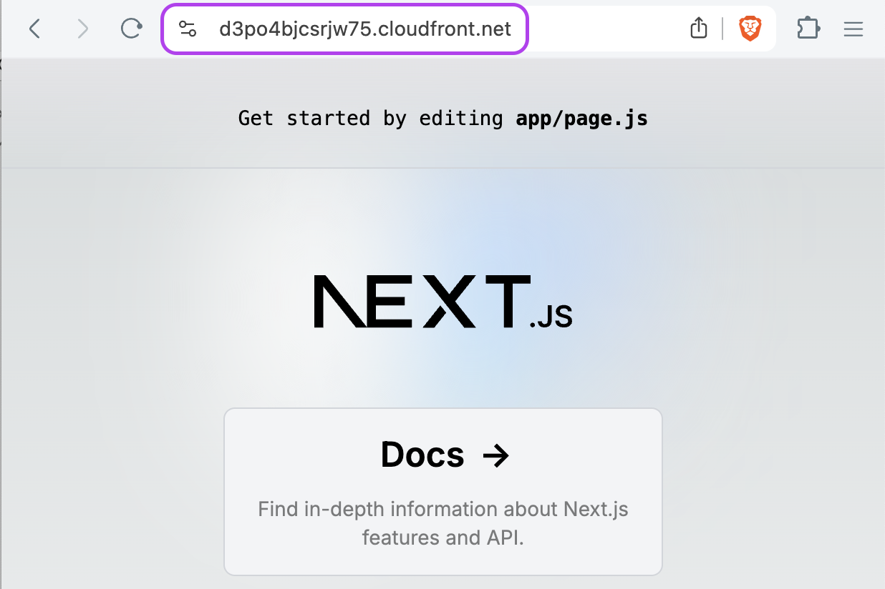

# Next.js on AWS Fargate with AWS CDK
 


## Architecture

See the [CDK code](./infra/bin/infra.ts) for the full architecture.

- A VPC with public, private, private isolated subnets
- An ECS cluster with a Fargate service
- A Route 53 private hosted zone for the ECS service (AWS CloudMap/Service Discovery)
- API Gateway w/ VPC Link Integration to the ECS service using the private DNS name
- An ECS task definition with a container that runs the Next.js app
- A CloudFront distribution with an API Gateway origin

## Deploy to AWS with CDK

First, you need to install [aws-cdk](https://www.npmjs.com/package/aws-cdk).


```bash
cd infra
npm install
# Bootstrap the CDK environment
cdk bootstrap --qualifier nextjscdk
# Deploy the stack
cdk deploy --all
```
